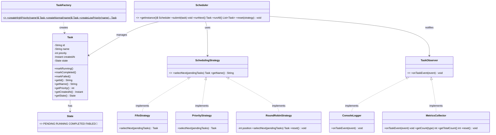

# UML Class Diagram

```mermaid
classDiagram
    %% -----------------------------------------------------------------------
    %% Model
    %% -----------------------------------------------------------------------
    class Task {
        -String id
        -String name
        -int priority
        -Instant createdAt
        -State state
        +markRunning()
        +markCompleted()
        +markFailed()
        +getId() String
        +getName() String
        +getPriority() int
        +getCreatedAt() Instant
        +getState() State
    }
    class State { <<enumeration>> PENDING RUNNING COMPLETED FABLED }
    Task --> State : has
    class TaskFactory { <<utility>> +createHighPriority(name)$ Task +createNormal(name)$ Task +createLowPriority(name)$ Task }
    TaskFactory ..> Task : creates
    class TaskObserver { <<interface>> +onTaskEvent(event) void }
    class ConsoleLogger { +onTaskEvent(event) void }
    class MetricsCollector { +onTaskEvent(event) void +getCount(type) int +getTotalCount() int +reset() void }
    TaskObserver <|.. ConsoleLogger : implements
    TaskObserver <|.. MetricsCollector : implements
    class SchedulingStrategy { <<interface>> +selectNext(pendingTasks) Task +getName() String }
    class FifoStrategy { +selectNext(pendingTasks) Task }
    class PriorityStrategy { +selectNext(pendingTasks) Task }
    class RoundRobinStrategy { -int position +selectNext(pendingTasks) Task +reset() void }
    SchedulingStrategy <|.. FifoStrategy : implements
    SchedulingStrategy <|.. PriorityStrategy : implements
    SchedulingStrategy <|.. RoundRobinStrategy : implements
    class Scheduler { <<singleton>> +getInstance()$ Scheduler +submit(task) void +runNext() Task +runAll() List~Task~ +reset(strategy) void }
    Scheduler --> SchedulingStrategy : uses
    Scheduler --> TaskObserver : notifies
    Scheduler --> Task : manages
```
