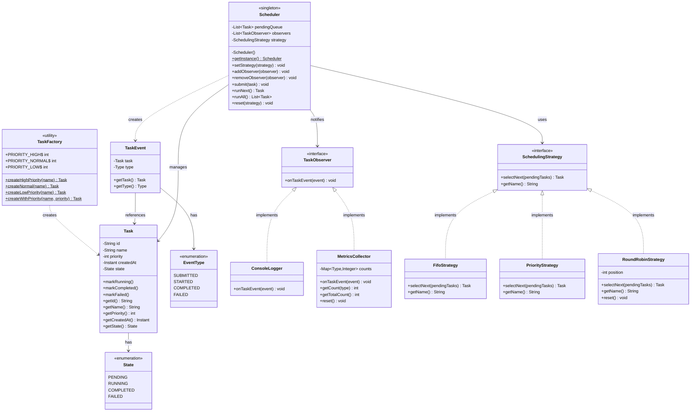

# UML Class Diagram

```mermaid
classDiagram
    %% -----------------------------------------------------------------------
    %% Model
    %% -----------------------------------------------------------------------
    class Task {
        -String id
        -String name
        -int priority
        -Instant createdAt
        -State state
        +markRunning()
        +markCompleted()
        +markFailed()
        +getId() String
        +getName() String
        +getPriority() int
        +getCreatedAt() Instant
        +getState() State
    }

    class State {
        <<enumeration>>
        PENDING
        RUNNING
        COMPLETED
        FAILED
    }

    Task --> State : has

    %% -----------------------------------------------------------------------
    %% Factory Pattern
    %% -----------------------------------------------------------------------
    class TaskFactory {
        <<utility>>
        +PRIORITY_HIGH$ int
        +PRIORITY_NORMAL$ int
        +PRIORITY_LOW$ int
        +createHighPriority(name)$ Task
        +createNormal(name)$ Task
        +createLowPriority(name)$ Task
        +createWithPriority(name, priority)$ Task
    }

    TaskFactory ..> Task : creates

    %% -----------------------------------------------------------------------
    %% Observer Pattern
    %% -----------------------------------------------------------------------
    class TaskObserver {
        <<interface>>
        +onTaskEvent(event) void
    }

    class TaskEvent {
        -Task task
        -Type type
        +getTask() Task
        +getType() Type
    }

    class EventType {
        <<enumeration>>
        SUBMITTED
        STARTED
        COMPLETED
        FAILED
    }

    class ConsoleLogger {
        +onTaskEvent(event) void
    }

    class MetricsCollector {
        -Map~Type,Integer~ counts
        +onTaskEvent(event) void
        +getCount(type) int
        +getTotalCount() int
        +reset() void
    }

    TaskObserver <|.. ConsoleLogger : implements
    TaskObserver <|.. MetricsCollector : implements
    TaskEvent --> EventType : has
    TaskEvent --> Task : references

    %% -----------------------------------------------------------------------
    %% Strategy Pattern
    %% -----------------------------------------------------------------------
    class SchedulingStrategy {
        <<interface>>
        +selectNext(pendingTasks) Task
        +getName() String
    }

    class FifoStrategy {
        +selectNext(pendingTasks) Task
        +getName() String
    }

    class PriorityStrategy {
        +selectNext(pendingTasks) Task
        +getName() String
    }

    class RoundRobinStrategy {
        -int position
        +selectNext(pendingTasks) Task
        +getName() String
        +reset() void
    }

    SchedulingStrategy <|.. FifoStrategy : implements
    SchedulingStrategy <|.. PriorityStrategy : implements
    SchedulingStrategy <|.. RoundRobinStrategy : implements

    %% -----------------------------------------------------------------------
    %% Singleton Pattern
    %% -----------------------------------------------------------------------
    class Scheduler {
        <<singleton>>
        -List~Task~ pendingQueue
        -List~TaskObserver~ observers
        -SchedulingStrategy strategy
        -Scheduler()
        +getInstance()$ Scheduler
        +setStrategy(strategy) void
        +addObserver(observer) void
        +removeObserver(observer) void
        +submit(task) void
        +runNext() Task
        +runAll() List~Task~
        +reset(strategy) void
    }

    Scheduler --> SchedulingStrategy : uses
    Scheduler --> TaskObserver : notifies
    Scheduler --> Task : manages
    Scheduler ..> TaskEvent : creates
```
